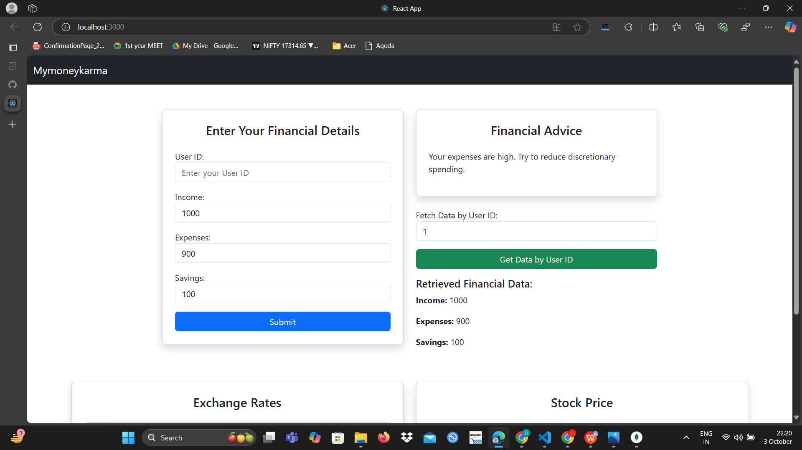
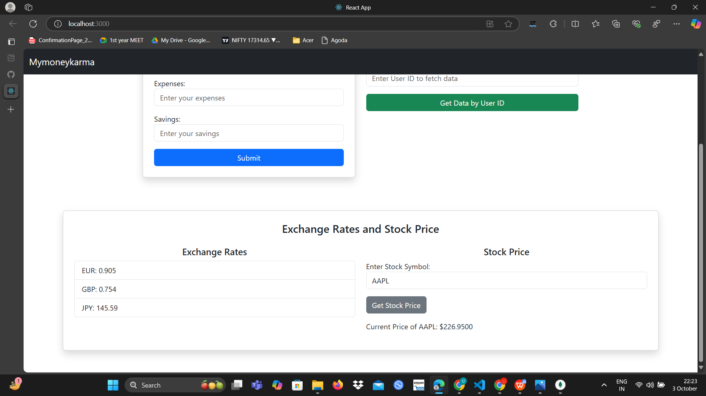
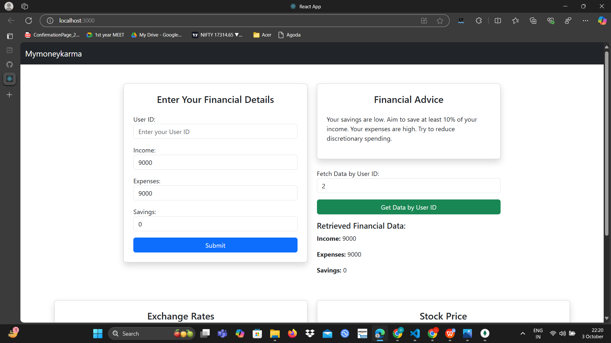
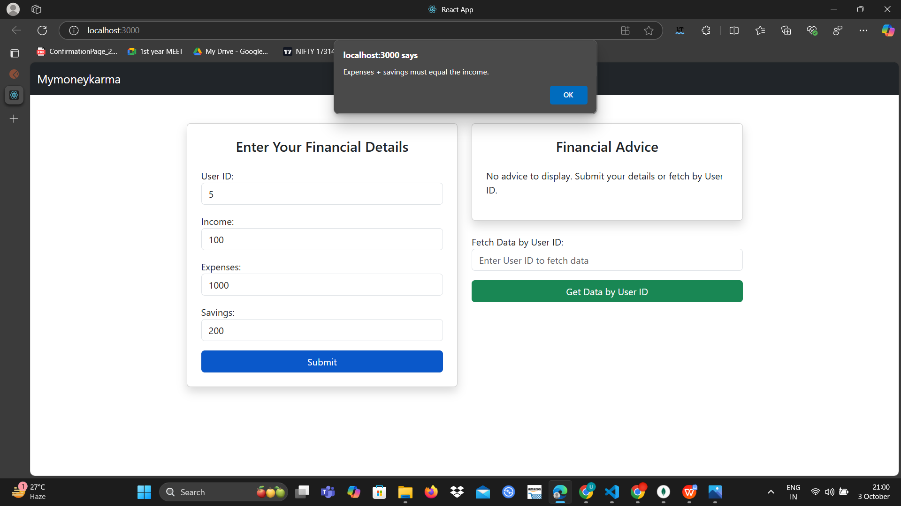

# Financial Dashboard

## Overview
The Financial Dashboard is a web application that helps users manage their financial data, providing advice based on user inputs such as income, expenses, and savings. The application also fetches real-time exchange rates and stock prices, helping users make informed financial decisions.

## Features
- **User Input**: Allows users to enter their financial details (income, expenses, savings) and receive personalized advice.
- **Fetch User Data**: Users can retrieve previously entered financial data using their User ID.
- **Exchange Rates**: Displays the latest exchange rates for EUR, GBP, and JPY against USD.
- **Stock Prices**: Users can check the current stock price for any company using its stock symbol.
- **Input Validation**: Ensures valid financial entries, such as no negative values and that expenses plus savings equal income.

## Technologies Used
- **Frontend**: React.js, Bootstrap
- **Backend**: Node.js, Express.js
- **APIs**:
  - [ExchangeRate-API](https://www.exchangerate-api.com/)
  - [Alpha Vantage](https://www.alphavantage.co/)

## Installation

1. Clone the repository:
   ```bash
   git clone https://github.com/YourUsername/FinancialDashboard.git
2. Navigate to the project directory:
   ```bash
   cd FinancialDashboard

3. Install the dependencies:
   ```bash
   npm install
## Running the Application
1. To run the application in development mode, use the following command:
   ```bash
   npm start

## Screenshots

### Homepage


### Exchange Rates & Stock Prices


### Fetch User Data


### Input Validation


